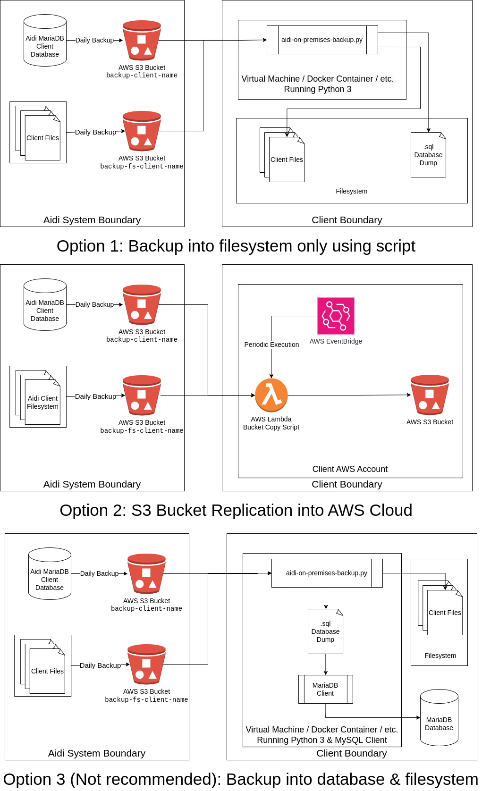
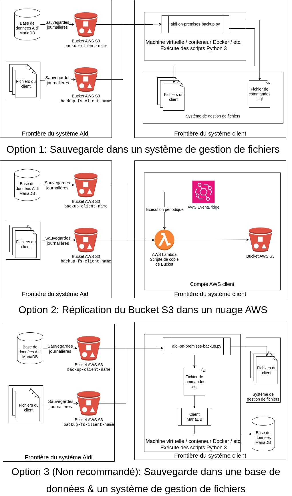

- [Aidi On-Premises Backup](#aidi-on-premises-backup)
  - [Quickstart](#quickstart)
  - [Prerequisites](#prerequisites)
  - [Integration with Client](#integration-with-client)
  - [Installation](#installation)
  - [Execution](#execution)
  - [Usage](#usage)
  - [Examples](#examples)
- [Sauvegardes Aidi Sur-Site](#sauvegardes-aidi-sur-site)
  - [Démarrage rapide](#démarrage-rapide)
  - [Prérequis](#prérequis)
  - [Intégration avec le client](#intégration-avec-le-client)
  - [Installation](#installation-1)
  - [Exécution](#exécution)
  - [Utilisation](#utilisation)
  - [Exemples](#exemples)

# Aidi On-Premises Backup

Aidi On-Premise Backup script

Generates a backup of an Aidi instance locally. Is essentially a wrapper for a boto3 connection to an AWS S3 bucket. 

Aidi reserves the right to modify the format, content, or structure of the data and tables without prior notice as its product evolves. Therefore, if the client develops their own queries to periodically extract data from this database, they will need to adjust their queries to ensure their continued operation in the event of a change to the table/data structure.

## Quickstart
- Obtain an Aidi backup bucket name, an Aidi backup access key and an Aidi backup secret key from support@aidi.io
- Make sure you have `python3` installed.
- Download the latest release from [release page](https://github.com/Aidi-Software/on-premises-backups/releases)
- From the unzipped directory, run `python3 -m pip install -r requirements.txt`
- From the unzipped directory, run the following command:

Linux / MacOS:
```
python3 aidi-on-premises-backup.py -b <backup_bucket_name> -a <backup_access_key> -s <backup_secret_key> -t /path/to/backup -f true -o false
```
Windows:
```
python3 aidi-on-premises-backup.py -b <backup_bucket_name> -a <backup_access_key> -s <backup_secret_key> -t C:\path\to\backup -f true -o false
```

## Prerequisites

A valid `python3` installation must be available on the operating system. Verify that a valid Python installation is present by typing  `python3 --version` in a terminal.

You must contact support@aidi.io to obtain the following informations:
- The backup bucket names. You may be given two bucket names: One for the database backups, and one for the filesystem. If that is the case, the command must be executed twice.
- The backup access key
- The backup secret key.

## Integration with Client
There are many ways this solution can be integrated within a client's on-premises architecture. At its core, Aidi offers backups in AWS S3 Buckets and the client is free to obtain the content of these AWS S3 Buckets using their own tools and methodology. This script simplifies obtaining the backups from the S3 Buckets for clients that do not leverage the AWS Cloud.

There are three proposed integrations methods.
- Option 1: This option leverages this script to backup the content of both buckets into a file system. The client will have to configure a virtual machine, Docker container or other way to run this Python 3 script periodically.
- Option 2: This option are for client that already have an AWS Cloud. This uses an AWS Lambda function to copy the content of both Aidi AWS S3 Bucket into the customer's AWS S3 Bucket. It also uses AWS EventBridge to periodically trigger the AWS Lambda function.
- Option 3 (Not Recommended): This option is for a client that wants to have the content of the Aidi database into their own MariaDB database. This option leverages the current script to backup the content of the files bucket into the client's filesystem. Furthermore, the current script is also used to seperately download the .sql database dump from the Database bucket, and uses a client such as `mysqlclient` to import this .sql database dump into a database. The client will have to configure a virtual machine, Docker container or another other way to run this Python 3 script and `mysqlclient` command periodically.



## Installation

1. Go to the [release page](https://github.com/Aidi-Software/on-premises-backups/releases) of this repository and download the zip file of the lastest release.
2. Unzip the folder and open a terminal at the root of the unzipped folder
3. Run the following command: `python3 -m pip install -r requirements.txt`

## Execution

1. Open a terminal at the root of the unzipped folder
2. Run the following command: `python3 aidi-on-premises-backup.py --help` to see all the parameters

## Usage

```
python3 aidi-on-premises-backup.py 
    -b|--aidi-backup-bucket <aidi_backup_bucket_name> 
    -a|--aidi-backup-access-key <aidi_backup_access_key> 
    [-s|--aidi-backup-secret-key <aidi_backup_secret_key>] 
    -t|--target-directory <target_directory> 
    [-f|--force-create-directory <force_create_directory>] 
    [-o|--overwrite-existing-files <overwrite_existing_files>]
```
-  `-b|--aidi-backup-bucket <aidi_backup_bucket_name>` (Required): Name of the bucket to fetch data from. Given by your Aidi customer service representative. The command must be executed once per bucket to backup. Example: `backup-fs-my-environment-name`.
-  `-a|--aidi-backup-access-key <aidi_backup_access_key>` (Required): Access key as given by your Aidi customer service representative. Example: `ABCDEFGHIJ1234567890`
-  `-s|--aidi-backup-secret-key <aidi_backup_secret_key>`: Secret key as given by your Aidi customer service representative. Can also be provided using the the `AIDI_BACKUP_SECRET_KEY` environment variable for improved security, if not provided as a command-line argument. Example: `aBcDeFgHiJkLmNoPqRsTuVwXyZ+1234567890123`
- `-t|--target-directory <target_directory>` (Required): The target directory where the backup should be located. Example: `/tmp/backup-2025-02-08`
- `-f|--force-create-directory <force_create_directory>`: Whether the directory (and all its parents) should automatically be created or not if they do not exist. May exit if this script is not given permission to create the directory. Defaults to `false`.
- `-o|--overwrite-existing-files <overwrite_existing_files>`: Overwrites the downloaded files if they do not already exist. Defaults to `false`.

## Examples

The following command downloads all files from the bucket named `backup-fs-my-environment-name` into the `backup-2025-25-08` folder (create the folder automatically), given the access key `ABCDEFGHIJ1234567890` and secret key `aBcDeFgHiJkLmNoPqRsTuVwXyZ+1234567890123`:

Linux / MacOS:
```
python3 aidi-on-premises-backup.py -b backup-fs-my-environment-name -a ABCDEFGHIJ1234567890 -s aBcDeFgHiJkLmNoPqRsTuVwXyZ+1234567890123 -t /backup-2025-25-08 -f true
python3 aidi-on-premises-backup.py -b backup-my-environment-name -a ABCDEFGHIJ1234567890 -s aBcDeFgHiJkLmNoPqRsTuVwXyZ+1234567890123 -t /backup-2025-25-08 -f true
```
Windows:
```
python3 aidi-on-premises-backup.py -b backup-fs-my-environment-name -a ABCDEFGHIJ1234567890 -s aBcDeFgHiJkLmNoPqRsTuVwXyZ+1234567890123 -t C:\backup-2025-25-08 -f true
python3 aidi-on-premises-backup.py -b backup-my-environment-name -a ABCDEFGHIJ1234567890 -s aBcDeFgHiJkLmNoPqRsTuVwXyZ+1234567890123 -t C:\backup-2025-25-08 -f true
```

# Sauvegardes Aidi Sur-Site 

Script de sauvegarde sur site Aidi

Génère une sauvegarde d'une instance Aidi localement. Est essentiellement une surcouche pour une connexion boto3 à un bucket AWS S3. 

Aidi se réserve le droit de modifier sans préavis le format, le contenu ou la structure des données et des tables selon l’évolution de son produit. Par conséquent, si le client développe ses propres requêtes pour extraire des données périodiquement à partir de cette base de données, il sera nécessaire qu’il doive ajuster ses requêtes pour assurer leur fonctionnement advenant un changement à la structure des tables/données.

## Démarrage rapide
- Obtenez un nom de bucket de sauvegarde Aidi, une clé d'accès de sauvegarde Aidi et une clé secrète de sauvegarde Aidi auprès de support@aidi.io
- Assurez-vous d'avoir `python3` installé
- Téléchargez la dernière version depuis [page de publication](https://github.com/Aidi-Software/on-premises-backups/releases)
- Depuis le répertoire décompressé, exécutez `python3 -m pip install -r requirements.txt`
- Depuis le répertoire décompressé, exécutez la commande suivante :

Linux / MacOS:
```
python3 aidi-on-premises-backup.py -b <nom_bucket_sauvegarde> -a <cle_acces_sauvegarde> -s <cle_secrete_sauvegarde> -t /emplacement/de/la/sauvegarde -f true -o false
```

Windows:
```
python3 aidi-on-premises-backup.py -b <nom_bucket_sauvegarde> -a <cle_acces_sauvegarde> -s <cle_secrete_sauvegarde> -t C:\emplacement\de\la\sauvegarde -f true -o false
```

## Prérequis

Une installation `python3` valide doit être disponible sur le système d'exploitation. Vérifiez qu'une installation Python valide est présente en saisissant `python3 --version` dans un terminal.

Vous devez contacter support@aidi.io pour obtenir les informations suivantes :
- Les noms des buckets de sauvegarde. Deux noms de buckets peuvent vous être attribués : un pour les sauvegardes de base de données et un pour le système de fichiers. Si tel est le cas, la commande doit être exécutée deux fois.
- La clé d'accès de sauvegarde
- La clé secrète de sauvegarde.

## Intégration avec le client

Cette solution peut être intégrée de nombreuses manières à l'architecture sur site d'un client. Aidi propose des sauvegardes dans des buckets AWS S3, et le client est libre d'en récupérer le contenu grâce à ses propres outils et méthodes. Ce script simplifie l'obtention des sauvegardes depuis les buckets AWS S3 pour les clients qui n'utilisent pas le cloud AWS.

Trois méthodes d'intégration sont proposées.
- Option 1 : Cette option utilise ce script pour sauvegarder le contenu des deux buckets AWS S3 dans un système de fichiers. Le client devra configurer une machine virtuelle, un conteneur Docker ou un autre moyen d'exécuter périodiquement ce script Python 3.
- Option 2 : Cette option est destinée aux clients disposant déjà d'un cloud AWS. Elle utilise une fonction AWS Lambda pour copier le contenu des deux buckets AWS S3 d'Aidi dans le bucket AWS S3 du client. Elle utilise également AWS EventBridge pour déclencher périodiquement la fonction AWS Lambda.
- Option 3 (non recommandée) : Cette option est destinée aux clients souhaitant intégrer le contenu de la base de données Aidi dans leur propre base de données MariaDB. Elle exploite le script actuel pour sauvegarder le contenu du bucket de fichiers dans le système de fichiers du client. De plus, le script actuel permet également de télécharger séparément le fichier .sql du bucket AWS S3 de base de données et utilise un client tel que `mysqlclient` pour importer ce fichier .sql dans une base de données MariaDB ou MySQL. Le client devra configurer une machine virtuelle, un conteneur Docker ou autre pour permettre l'exécution périodique de ce script Python 3 et de la commande `mysqlclient`

  

## Installation

1. Accédez à la [page de publication](https://github.com/Aidi-Software/on-premises-backups/releases) de ce répertoire et téléchargez le fichier zip de la dernière version.
2. Décompressez le dossier et ouvrez un terminal à la racine du dossier décompressé
3. Exécutez la commande suivante : `python3 -m pip install -r requirements.txt`

## Exécution

1. Ouvrez un terminal à la racine du dossier décompressé
2. Exécutez la commande suivante : `python3 aidi-on-premises-backup.py --help` pour voir tous les paramètres

## Utilisation

```
python3 aidi-on-premises-backup.py 
    -b|--aidi-backup-bucket <aidi_backup_bucket_name> 
    -a|--aidi-backup-access-key <aidi_backup_access_key> 
    [-s|--aidi-backup-secret-key <aidi_backup_secret_key>] 
    -t|--target-directory <target_directory> 
    [-f|--force-create-directory <force_create_directory>] 
    [-o|--overwrite-existing-files <overwrite_existing_files>]
```
- `-b|--aidi-backup-bucket <aidi_backup_bucket_name>` (Obligatoire) : nom du bucket à partir duquel récupérer les données. Fourni par votre représentant client Aidi. La commande doit être exécutée une fois par bucket à sauvegarder. Exemple : `backup-fs-my-environment-name`.
- `-a|--aidi-backup-access-key <aidi_backup_access_key>` (Obligatoire) : clé d'accès telle que fournie par votre représentant client Aidi. Exemple : `ABCDEFGHIJ1234567890`
- `-s|--aidi-backup-secret-key <aidi_backup_secret_key>` : clé secrète fournie par votre représentant client Aidi. Peut également être fournie à l'aide de la variable d'environnement `AIDI_BACKUP_SECRET_KEY` pour une sécurité améliorée, si elle n'est pas fournie comme argument de ligne de commande. Exemple : `aBcDeFgHiJkLmNoPqRsTuVwXyZ+1234567890123`
- `-t|--target-directory <target_directory>` (obligatoire) : répertoire cible dans lequel la sauvegarde doit être située. Exemple : `/tmp/backup-2025-02-08`
- `-f|--force-create-directory <force_create_directory>` : indique si le répertoire (et tous ses parents) doivent être créés automatiquement ou non s'ils n'existent pas. Le script peux arréter son exécution s'il n'a pas l'autorisation de créer le répertoire. La valeur par défaut est `false`.
- `-o|--overwrite-existing-files <overwrite_existing_files>` : remplace les fichiers téléchargés s'ils n'existent pas déjà. La valeur par défaut est `false`.

## Exemples

Téléchargement de tous les fichiers du bucket nommé `backup-fs-my-environment-name` dans le dossier `backup-2025-25-08` (créer le dossier automatiquement), étant donné la clé d'accès `ABCDEFGHIJ1234567890` et la clé secrète `aBcDeFgHiJkLmNoPqRsTuVwXyZ+1234567890123`. :

Linux / MacOS:
```
python3 aidi-on-premises-backup.py -b backup-fs-my-environment-name -a ABCDEFGHIJ1234567890 -s aBcDeFgHiJkLmNoPqRsTuVwXyZ+1234567890123 -t /backup-2025-25-08 -f true
python3 aidi-on-premises-backup.py -b backup-my-environment-name -a ABCDEFGHIJ1234567890 -s aBcDeFgHiJkLmNoPqRsTuVwXyZ+1234567890123 -t /backup-2025-25-08 -f true
```
Windows:
```
python3 aidi-on-premises-backup.py -b backup-fs-my-environment-name -a ABCDEFGHIJ1234567890 -s aBcDeFgHiJkLmNoPqRsTuVwXyZ+1234567890123 -t C:\backup-2025-25-08 -f true
python3 aidi-on-premises-backup.py -b backup-my-environment-name -a ABCDEFGHIJ1234567890 -s aBcDeFgHiJkLmNoPqRsTuVwXyZ+1234567890123 -t C:\backup-2025-25-08 -f true
```
